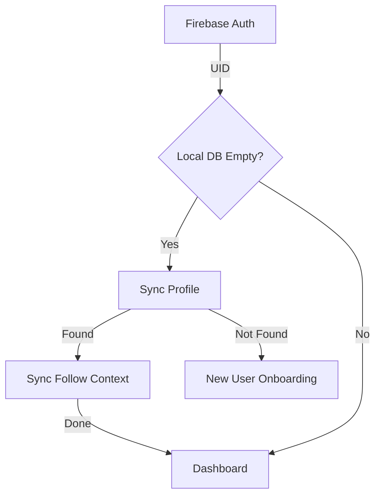

# Walkthrough - Account Restoration & Follower Count Self-Healing

I have implemented a robust account restoration system and a self-healing follower count mechanism to ensure data integrity across app cache clears and multiple devices.

## Changes

### 1. Authoritative Account Restoration
The app now treats Firebase Auth as the single source of truth for identity, ensuring that clearing local storage does not reset existing users.
- **Hierarchical Sync**: When an existing user signs in (or opens the app after a cache clear), the app now hierarchically restores the **Profile**, then the **Active Follow**, and finally the **Organization rules** from Firestore into the local Drift database.
- **Restoration State**: Introduced an `isRestoring` state in `app.dart` that blocks the UI from entering onboarding until the restoration is complete.
- **Error Resilience**: Added a dedicated "Restoration Failed" UI with a **Retry** button and **Sign Out** option for handling network interruptions during the initial sync.

### 2. Self-Healing Follower Counts
I have preserved the performance of the denormalized `followerCount` field while adding a mechanism to fix historical corruption (like the "9 to 0" issue).
- **Authoritative Reconciliation**: Added logic to use Firestore's aggregate `count()` query to determine the true number of membership documents.
- **Smart Healing**: The reconciliation is triggered when a user selects an organization for **Preview**. The counter is only updated in Firestore if a discrepancy is detected, avoiding unnecessary writes.
- **Atomic Consistency**:
    - `joinOrganizationAtomic`: Ensures the counter only increments if the membership document doesn't already exist.
    - `leaveOrganizationAtomic`: Added a transaction to atomically delete the membership and decrement the counter during account deletion.

### 3. UI/UX Standardization
- Standardized terminology to **"followers"** across Search results and the Organization Preview.
- Updated the "Organization rules found" conflict screen with neutral terminology.

## Verification Results

### Automated Tests
- **`flutter analyze`**: **PASS**
- **`flutter test`**: **87/87 passed.**
    - Verified that `_processAuthState` correctly awaits hierarchical sync.
    - Verified that `reconcileFollowerCount` correctly heals the counter in a mock Firestore environment.
    - Updated existing onboarding tests to seed member documents for reconciliation support.

### Technical Detail: Restoration Flow

> [!IMPORTANT]
> The app will now show a "Restoring your session..." indicator briefly upon startup or after login while it rebuilds the local cache from Firestore. This ensures the Dashboard always has the necessary data to render correctly without fallback warnings.
